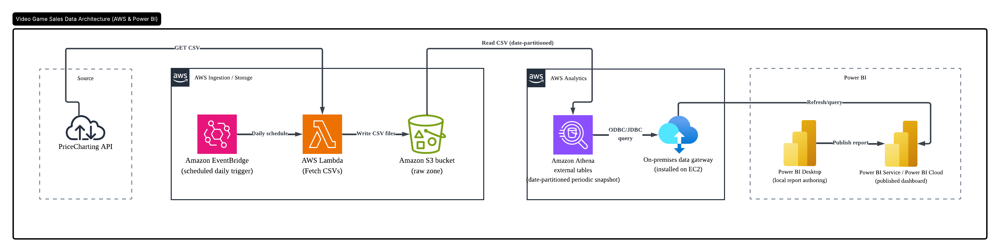
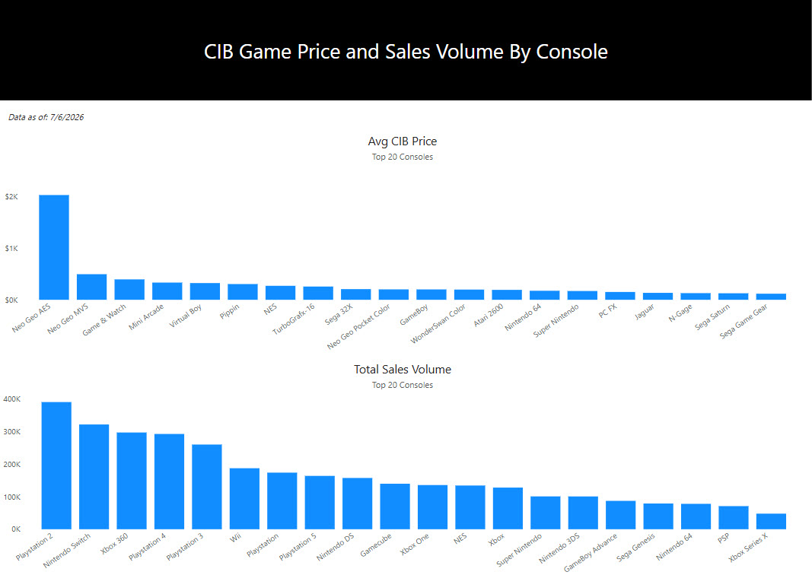
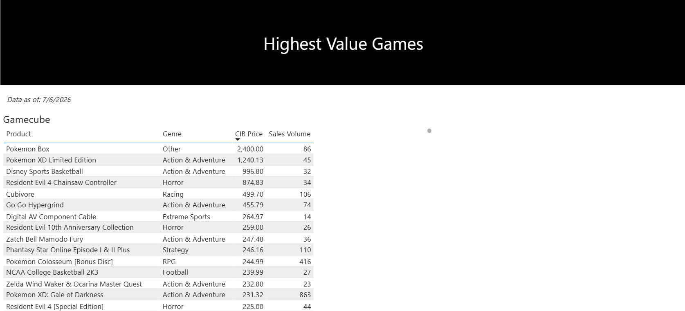

# Data pipeline to pull video game sales info from the PriceCharting API and feed into Power BI
## Use Case
I accumulated a lot of retro games over the years. Occasionally I would get this urge to declutter and sell some of them on Carousell. I wasn’t sure what the market price was for some of these games, especially rare ones that few people were listing. At some point I stumbled across the PriceCharting website. They use sales data from eBay and their own marketplace to estimate the market value of video games. Using their market prices has been effective when I sell rare games on Carousell.

The PriceCharting API enables programmatic analysis of historical sales volume and price fluctuations (also, prices on the website are for end of month only, while API data is updated daily). I’m curious if I can use this data to spot popular games listed below market value and/or predict when the price of some rare game is going to spike up. Sometimes it’s nice to play a retro game and sell it at a higher price after enjoying the nostalgia. I did this with Fire Emblem: Path of Radiance for Gamecube - got it for $130 in 2017, which sounded like a lot, but I sold it last year for $220.

## Data Architecture

Notes on the data pipeline using AWS:
1) Lambda function fetches CSV files from PriceCharting API daily. The schedule is set via EventBridge and the CSV files are stored in S3. Each CSV file contains roughly 100k rows.
2) Date-partitioned data tables are created from the CSV files in Athena, structured as a periodic snapshot.
3) Dashboard is designed locally on Power BI Desktop and published to Power BI Cloud.
4) Data updates from the Athena table are sent to Power BI Cloud via an on-premises data gateway installed on an EC2 instance.

## Files In This Repo
* lambda_function.py - Lambda function in Python that extracts data from the PriceCharting API, does some data cleaning, and tells AWS to store the files in S3
* prices.sql - SQL DDL statement used to create the data table in Athena

## Data Dictionary
Check out the PriceCharting API documentation for a description of the fields in the CSV files: https://lnkd.in/ggUNTyE5

## Dashboard Screenshots

